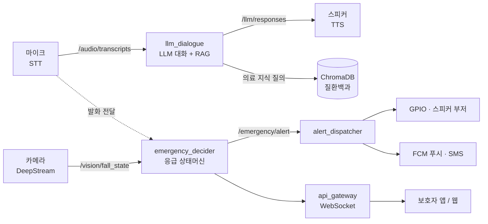
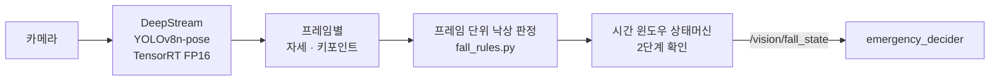
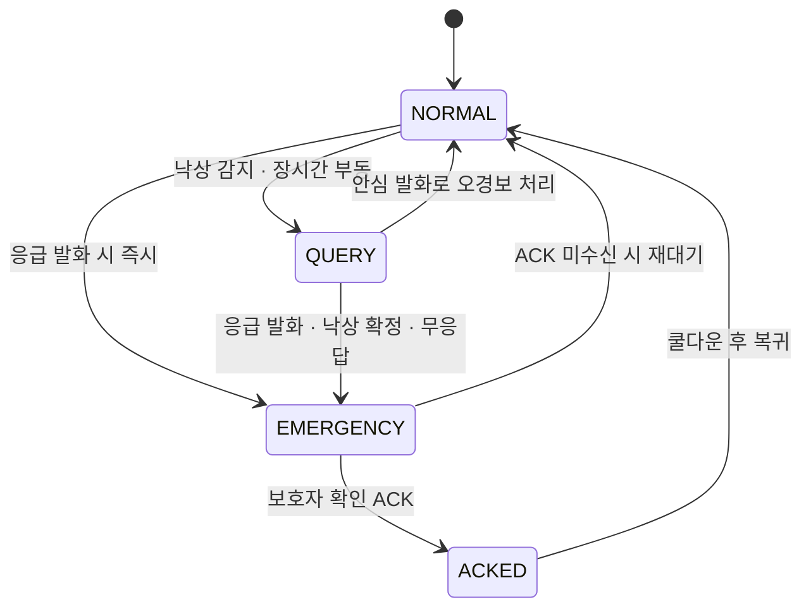

# 🧡 마음돌봄(Mind-Care) 챗봇 팀 프로젝트
### **음성 대화 · 의료 지식 RAG · 낙상 감지 · 응급 알림** — NVIDIA Jetson AGX Xavier 한 대에서 동작하는 온디바이스 챗봇....................


---

## 📌 프로젝트 요약 (Project Overview)

마음돌봄(Mind-Care)은 **NVIDIA Jetson AGX Xavier 한 대에서 모든 AI 추론이 동작하는 온디바이스 돌봄 로봇/단말 소프트웨어**입니다. 카메라와 마이크로 독거 어르신의 상태를 살피고, 따뜻한 말벗이 되어 한국어로 대화하며, 낙상이나 응급 발화를 감지하면 즉시 보호자에게 알립니다. 음성 인식(STT)부터 대형 언어모델(LLM) 대화, 의료 지식 검색(RAG), 비전 인식, 응급 판단까지 클라우드에 의존하지 않고 엣지 디바이스 위에서 전 과정을 처리합니다.

기술적으로는 ROS 2 토픽 버스 위에 음성 · 비전 · 응급 · API 네 개의 서브시스템을 느슨하게 결합한 구조입니다. 이 프로젝트가 답하고자 한 핵심 질문은 다음과 같습니다. **7.8B 규모의 한국어 LLM을 32GB Jetson에서 실시간 대화가 가능한 속도로 돌릴 수 있는가? / 건강 질문에 환각 없이 신뢰할 수 있는 의료 근거로 답할 수 있는가? / 낙상을 놓치지 않으면서도 앉기·굽히기 같은 일상 동작을 오검출하지 않을 수 있는가? / 응급 상황을 오경보 없이 보호자에게 확실하게 전달할 수 있는가?** -> 이 네 가지의 과제들을 온디바이스 환경에서 코드로 검증하는 것이 목표였습니다.

---

## 🎯 핵심 목표 (Motivation)

| 핵심 기능 &emsp;&emsp;&emsp;&emsp; | 상세 목표 |
| :--- | :--- |
| **음성 대화 (Voice Dialogue)** | 음성 인식(STT) → EXAONE LLM → 음성 합성(TTS) 파이프라인으로 어르신과 자연스러운 한국어 대화를 주고받음 |
| **의료 지식 RAG** | 서울아산병원 질환백과를 벡터 DB로 색인하여, 건강 질문에 환각 없이 신뢰할 수 있는 근거로 응답 |
| **비전 케어 (Vision Care)** | 얼굴·표정 인식으로 정서 상태를 파악하고, YOLOv8-pose 자세 추정 기반으로 낙상을 감지 |
| **응급 대응 (Emergency Response)** | 4단계 상태머신으로 오경보를 거른 뒤, 부저·푸시·SMS 다중 채널로 보호자에게 경보 발령 |
| **보호자 연동 (Caregiver Link)** | 모바일 Flutter 앱 / 웹 대시보드로 어르신의 실시간 상태와 경보를 수신 |

---

## 📂 프로젝트 구조 (Project Structure)

```text
마음돌봄/
├─ mind_care_vision/                  # 음성·대화 서브시스템 + RAG
│  ├─ mind_care_vision/               #   ROS 2 패키지: audio_bridge / llm_dialogue / tts 노드, rag.py
│  ├─ config/                         #   ROS 파라미터 (hri_params*.yaml)
│  ├─ launch/                         #   launch 파일
│  ├─ scripts/                        #   기동·점검 스크립트 (start_llama_server.sh 등)
│  └─ tools/                          #   RAG 인덱스 구축 도구
├─ release/
│  ├─ vision/mind_care_perception/    # 비전 ROS 2 패키지 (얼굴·표정·낙상)
│  └─ emergency/
│     ├─ mind_care_emergency/         #   응급 판단 상태머신 + 알림 디스패처
│     └─ mind_care_api/               #   FastAPI 게이트웨이 + WebSocket + 웹 데모 클라이언트
├─ urgent_alarm_app/                  # 보호자용 Flutter 앱
├─ requirements.*.txt                 # Python 의존성 (core / xavier / full)
├─ SETUP.md                           # 설치 가이드
├─ XAVIER_INSTALL_GUIDE.md            # Jetson AGX Xavier 상세 설치 가이드
└─ HANDOVER.md                        # 코드베이스 인수인계 / 구성 개요
```

> 📱 보호자 Flutter 앱(`urgent_alarm_app/`)을 빌드하려면 본인 Firebase 프로젝트의 `google-services.json`을 `urgent_alarm_app/android/app/`에 직접 배치해야 하며, 보안상 저장소에 포함되지 않습니다.

**ROS 2 패키지 (4개)**

| 패키지 | 주요 노드 | 역할 |
| :--- | :--- | :--- |
| `mind_care_vision` | `audio_bridge_node`, `llm_dialogue_node`, `tts_node` | STT · LLM 대화 · RAG · TTS |
| `mind_care_perception` | `vision_deepstream_node`, `fall_detection_node` | 얼굴/표정 인식, 낙상 감지 |
| `mind_care_emergency` | `emergency_decider_node`, `alert_dispatcher_node` | 응급 판단, 다중 채널 알림 |
| `mind_care_api` | `api_gateway_node` | FastAPI + WebSocket 보호자 게이트웨이 |

---

## 🏗️ Architecture & 핵심 구현 (Architecture & Core Implementation)

### 1. 시스템 아키텍처

ROS 2 토픽 버스 위에서 음성 · 비전 · 응급 · API 서브시스템이 느슨하게 결합되어 동작함. 토픽으로 분리되어 있어 각 파트를 독립적으로 개발 · 교체 · 테스트할 수 있음.



### 2. 언어모델 (LLM)

어르신과 자연스러운 한국어 대화를 주고받는 부분. 한국어에 강한 **EXAONE-3.5-7.8B-Instruct**(LG AI Research)를 기본 모델로 쓰고, `llama.cpp` 서버로 추론.

| 항목 | 내용 |
| :--- | :--- |
| **기본 모델** | EXAONE-3.5-7.8B-Instruct — 한국어 네이티브 (대체 모델: Qwen2.5-3B-Instruct) |
| **경량화** | GGUF 양자화 — `Q3_K_M`(속도) / `Q4_K_M`(품질), 약 4\~4.7 GB |
| **추론 환경** | llama.cpp 서버 · GPU 부분 오프로드 · 컨텍스트 2048 토큰 |

`llm_dialogue_node`는 가장 최근 발화만 처리해 지연이 쌓이지 않게 하고, RAG가 켜져 있으면 관련 의료 지식을 프롬프트에 함께 넣어 요청함. 페르소나는 70\~80대 어르신을 돌보는 다정한 말벗 으로, 1\~2문장으로 짧게 답하며 **의학적 진단이나 약 복용 지시는 하지 않도록** 시스템 프롬프트로 제약했음.


### 3. 의료 지식 검색 (RAG)

건강 관련 질문에 **신뢰할 수 있는 의료 정보를 근거로** 답하기 위한 검색 증강 생성(RAG) 모듈. **서울아산병원 질환백과**(17개 진료 분야)를 다국어 임베딩 모델(`paraphrase-multilingual-MiniLM-L12-v2`)로 벡터화해 ChromaDB에 색인하고, 질문과 유사한 상위 문서를 찾아 LLM 프롬프트에 근거로 넣음.

검색 결과는 "진단 · 처방 금지" 같은 사용 규칙과 함께 시스템 메시지로 주입되어, LLM이 임의로 지어내지 않고 **검색된 근거 안에서만** 답하도록 유도.


### 4. 낙상 감지 (Fall Detection)

카메라 영상에서 자세를 추정하고, **매 프레임의 낙상 여부를 시간 윈도우로 누적**해 순간 오검출을 거른 뒤 실제 낙상을 확정. 
<br/>구현: `release/vision/mind_care_perception/`



`YOLOv8n-pose`로 사람의 자세와 키포인트를 검출하고(Jetson에서 TensorRT FP16으로 가속), `fall_rules.py`가 매 프레임을 낙상/정상으로 판정. 한 프레임만 보는 신호(바운딩박스 종횡비, 머리 높이 급강하)는 앉기·굽히기와 구분하기 어렵기 때문에, 상태머신이 두 단계로 확인함.

- **`fall_detected`** — 짧은 시간 윈도우 안에서 낙상으로 판정된 프레임 비율이 일정 수준 이상
- **`fall_confirmed`** — 그 뒤로 몇 초간 거의 움직임이 없음(쓰러진 채 정지) → 실제 낙상으로 확정

확정 결과는 `/vision/fall_state`로 발행되어 `emergency_decider`가 응급 상태로 전이시킴.


### 5. 응급 판단 (Emergency Decision)

낙상이나 응급 발화 같은 위험 신호를 받아 **4단계 상태머신**으로 응급 여부를 판정하고, 오경보를 거른 뒤 경보를 발령. 
<br/>구현: `release/emergency/mind_care_emergency/`



- **NORMAL** — 평상시. 낙상 감지·장시간 부동이면 `QUERY`로, 응급 발화면 즉시 `EMERGENCY`로 전이
- **QUERY** — "괜찮으세요?"라고 먼저 묻고 잠시 대기. 안심 발화면 `NORMAL`로 복귀(오경보로 기록), 무응답·응급 발화·낙상 확정이면 `EMERGENCY`
- **EMERGENCY** — 경보 발령. 보호자가 확인(ACK)하면 `ACKED`, 일정 시간 응답이 없으면 `NORMAL`로 자동 복귀해 다음 응급에 대비
- **ACKED** — 보호자 확인 완료. 쿨다운 후 `NORMAL`

응급 발화는 질환명이 아니라 **본인이 위급함을 호소하는 표현**("도와줘 · 살려줘 · 숨을 못 쉬겠어" 등)으로 감지함. `EMERGENCY`에 진입하면 경보가 `alert_dispatcher`를 통해 **GPIO · 스피커 부저 · FCM 푸시 · SMS**로, `api_gateway`를 통해 **보호자 웹**으로 동시에 전파됨.


### 6. 하드웨어 구성

| 구성 요소 | 사양 / 모델 | 용도 |
| :--- | :--- | :--- |
| **메인 컴퓨트** | NVIDIA Jetson AGX Xavier 32 GB (JetPack 5.x, Ubuntu 20.04, CUDA 11.4) | 온디바이스 AI 추론 전체 |
| **카메라** | USB UVC 또는 CSI 카메라 (720p / 30 fps 이상) | 얼굴·표정·낙상 인식 |
| **마이크** | USB 마이크 (ReSpeaker 4-Mic Array 권장) | 음성 입력 / VAD |
| **스피커** | 3.5 mm 또는 USB 스피커 | TTS 음성 출력 |
| **부저** | 5 V 액티브 부저 (GPIO BOARD pin 7) | 응급 알림음(사이렌) |
| **네트워크** | 이더넷 권장 | 모델 다운로드, edge-TTS |
| **보호자 단말** | 스마트폰(Flutter 앱) 또는 웹 브라우저 | 실시간 상태·경보 수신 |

---

## 🚀 빠른 시작 (Quick Start)

전체 설치 절차는 [`SETUP.md`](SETUP.md), Jetson 상세 가이드는 [`XAVIER_INSTALL_GUIDE.md`](XAVIER_INSTALL_GUIDE.md)를 참고해주세요:)

```bash
# 1) 의존성 설치 (가상환경)
python3 -m venv .venv-ros --system-site-packages
source .venv-ros/bin/activate
pip install -r requirements.xavier.txt        # Jetson 환경

# 2) ROS 2 워크스페이스 빌드
cd ~/ros2_ws && colcon build --symlink-install
source install/setup.bash

# 3) LLM 서버 기동
bash mind_care_vision/scripts/start_llama_server.sh

# 4) HRI 시스템 기동
ros2 launch mind_care_vision hri_system.launch.py
```

---

## ✨ 주요 결과 및 분석 (Key Findings & Analysis)

| 발견 / 결정 &nbsp;&nbsp;&nbsp;&nbsp;&nbsp;&nbsp;&nbsp;&nbsp; | 내용 |
| :--- | :--- |
| **낙상은 한 프레임으로 판단할 수 없다** | 초기 버전은 앉기·물건 줍기를 낙상으로 자주 오인했습니다. 한 장면이 아니라 시간 윈도우로 모아 보고, 쓰러진 뒤 정지 상태까지 확인하는 2단계 검증을 넣어 URFDD 데이터셋 기준 **Recall 0.77 / Precision 0.68**을 확보했습니다. |
| **응급 키워드는 <br>"증상 호소" 위주로** | 질환명을 그대로 매칭하니 RAG 의료 상담 중 단순 정보 질문까지 응급으로 잡혔습니다. 본인이 위급함을 호소하는 표현 위주로 키워드를 다시 추렸습니다. |
| **경보보다 <br>질문을 먼저** | 헛경보가 반복되면 보호자가 알림을 무시하게 됩니다. 위험 신호가 잡히면 곧바로 경보를 울리는 대신 `QUERY` 단계에서 "괜찮으세요?"를 먼저 물어 오경보를 걸러냈습니다. |
| **온디바이스 LLM은 속도와 품질의 타협** | 7.8B 모델을 작은 보드에서 실시간으로 돌리려면 품질을 조금 양보해야 했습니다. 양자화 · GPU 부분 오프로드 · 짧은 응답 길이를 조합해 "대화가 되는" 지점을 찾았습니다. |
| **경보는 다중 채널 + 자동 복귀로** | 알림 채널이 하나면 보호자가 놓칠 수 있습니다. 부저·푸시·SMS·웹 네 채널로 동시에 알리고, 보호자 응답이 없으면 시스템이 스스로 평상 상태로 돌아가 다음 응급에 대비합니다. |

---

## 💡 회고록 (Retrospective)

이번 팀 프로젝트 마음돌봄은 '클라우드 없이, 어르신 댁에 놓인 단말 한 대 안에서 모든 AI가 돌아가야 한다'는 제약에서 출발했습니다. 음성 인식부터 언어모델, 비전, 응급 알림까지 한 보드에서 처리해야 했고, 그래서 설계의 모든 선택은 '제한된 자원으로 무엇을 지킬 것인가'라는 질문으로 모였습니다. 첫 관문은 모델이 아니라 플랫폼이었습니다. Jetson Xavier에 운영체제를 올리고 ROS 2와 CUDA 버전을 맞추는 일은 작은 불일치 하나에도 환경 전체가 무너질 만큼 까다로웠고, 본격적인 개발에 앞서 안정적으로 재현되는 빌드 환경을 확보하는 것부터가 하나의 과제였습니다.

가장 큰 난제는 7.8B 규모의 언어모델을 이 보드 위에서 실시간으로 구동하는 일이었습니다. 양자화 수준, GPU에 올리는 레이어 범위, 응답 길이를 번갈아 조정하며 '실사용 가능한 속도'와 '쓸 만한 답변 품질'이 만나는 지점을 찾아야했는데 이는 정해진 답이 있는 문제가 아니라, 측정과 조정을 반복하며 균형점을 직접 잡아 나가는 작업이었습니다. 모델을 그대로 올리면 메모리가 부족했고, 양자화로 용량을 줄이면 이번엔 응답이 느려져 대화의 흐름이 끊긴다는것이 핵심 난제였습니다. 7.8B 모델을 4.7GB짜리 'Q4_K_M' GGUF로 올리면 충분히 돌아갈 줄 알았는데, Xavier 위에서는 응답이 늘어지면서 대화 흐름이 자꾸 끊겼습니다. 결국 한 단계 더 가벼운 'Q3_K_M' 까지 떨궈 속도를 확보하고, 'n_gpu_layers'를 33까지 올려 모델의 모든 레이어를 GPU에 얹는 식으로 VRAM을 끝까지 쥐어짰습니다. 품질을 조금 양보하고서야 비로소 사람의 호흡에 맞는 속도가 나왔습니다. 그런데 속도가 잡히니 이번엔 말투가 문제였습니다. 어르신께 드리는 인사인데 자꾸 챗봇스러운 친절체가 끼어들어, 시스템 프롬프트를 수십 번 갈아엎었습니다. 결국 '1~2문장으로 짧게'라는 한 줄을 페르소나에 못 박고 나서야 비로소 말벗다운 호흡이 잡혔습니다. 

낙상 감지는 정확도와 신뢰성을 동시에 만족시켜야 하는 까다로운 영역이었습니다. 'YOLOv8-pose'로 자세 자체는 잘 잡혔지만, 허리를 굽혀 물건을 줍거나 바닥에 앉는 동작까지 낙상으로 판정해버려서 데모만 돌리면 부저가 끊임없이 울었고, 임계값을 올리면 이번엔 정작 진짜 낙상을 놓치는 식이었습니다. URFDD 데이터셋으로 평가를 돌려봐도 정밀도와 재현율이 시소처럼 맞바뀌었고, 한 프레임의 자세 정보만으로 일상 동작과 낙상을 가르는 일은 원리적으로 어렵다는 결론에 닿았습니다. 그러다 실제 낙상 영상을 모아 돌려보며 한 가지를 깨달았습니다 — 사람은 넘어지면 보통 그 자리에 몇 초간 가만히 있다는 사실이었으며, 특히나 마음돌봄 챗봇의 사용 대상인 혼자사는 어르신들은 위와 같은 특징을 가장 크게 갖고있습니다. 이를 통해서 짧은 시간 안에 낙상 자세가 일정 비율 이상 모이면 우선 의심하고(fall_detected), 뒤이어 약 5초간 거의 움직임 없이 정지해 있을 때 비로소 낙상으로 확정(fall_confirmed)하는 2단계 검증으로 구조를 바꿨습니다. 앉기·굽히기처럼 잠깐 멈췄다 다시 움직이는 일상 동작은 두 번째 관문에서 자연스럽게 걸러졌습니다. 모델 지표를 소수점 둘째 자리 올리려고 애쓰기보다, 시스템이 어떤 흐름으로 판단하고 이 흐름을 따라 우리가 목표하는바가 무엇인지를 다시 파악하는 편이 훨씬 큰 차이를 만든다는 사실을 배웠습니다.
 
같은 깨달음이 응급 판단에도 그대로 옮겨갔습니다. 처음엔 낙상이나 위험 발화가 잡히면 곧바로 보호자 단말로 푸시를 쏘려고 했는데, 시나리오를 머릿속에 그려보다 한 가지 사실에 막혔습니다 — 새벽에 헛알림이 한 번 가면 자식 입장에서는 그 뒤부터 알림 자체를 신뢰하지 않게 되고, 그 순간 시스템은 정작 진짜 응급에서도 의미를 잃습니다. 그래서 위험 신호와 경보 사이에 'QUERY' 라는 한 단계를 끼워 넣었습니다. 어르신께 능동적으로 "괜찮으세요?"라고 먼저 묻고, 30초 안에 답이 없거나 응급 발화가 들어올 때만 비로소 'EMERGENCY'로 넘어가는 4단계(NORMAL → QUERY → EMERGENCY → ACKED) 상태머신 구조입니다. 응급 키워드 사전도 비슷한 식으로 손을 봤습니다. 초기에는 '심근경색', '뇌졸중' 같은 질환명을 가득 채워 넣었는데, 어르신이 RAG로 "심근경색이 뭐예요?" 같은 정보 질문만 던져도 시스템이 응급으로 오인해버렸습니다. 결국 질환명을 모두 빼고 '도와줘', '살려줘', '숨을 못 쉬겠어'와 같은 본인이 위급함을 호소하는 표현으로만 범위를 좁혀 다시 추렸습니다. 이 과정에서 사용자(어르신)의 생각과 행동을 머릿속에 떠올리며 키워드 한 개를 넣고 빼는 일이, 코드를 한 줄 짜는 것보다 훨씬 더 신중해야 한다는 사실을 체감했습니다. 

마지막까지 발목을 잡은 건 결국 통합이었습니다. 노드 하나하나는 단독으로는 멀쩡히 도는데, 네 개를 Xavier 한 보드에 동시에 띄우면 GPU 메모리가 빠듯해지고 ROS 2 토픽 지연이 누적되면서 TTS 음성이 사용자의 발화보다 몇 초씩 늦게 따라 나오는 식이었습니다. 가장 효과적이었던 방법은 LLM 노드에서 입력 발화마다 sequence 번호를 매겨, 응답을 만들기 직전에 자신이 더 이상 최신 발화가 아니면 그 응답을 통째로 폐기하도록 만든 것이었습니다. 어르신이 연달아 말씀하셔도 가장 최근 한 마디에 대한 답만 끝까지 나오고, 옛 발화에 대한 답이 뒤늦게 끼어드는 일이 사라졌습니다. 이론으로만 접했던 '실시간 시스템'이라는 단어가 실제로 어떤 무게를 가지는지 다시 한번 직접 손으로 더듬어가며 알게 된 경험이었습니다. 

프로젝트를 마친 후 그동안의 과정들을 돌이켜보면 핵심은 새로운 모델을 만드는 것이 아니라 이미 검증된 기술들을 제한된 하드웨어 안에서 함께 동작하게 만드는 데 있었습니다. 각 기능이 따로 잘 도는 것과, 네 개의 서브시스템이 한 보드 위에서 자원을 나눠 쓰며 끊김 없이 맞물리는 것은 전혀 다른 문제였습니다. 모델의 성능 지표만 들여다보던 관점에서 '이 기술을 실제 환경의 어떤 제약 위에서 동작시킬 것인가' 까지 함께 고민하게 된 것이, 이번 프로젝트에서 얻은 가장 큰 수확입니다. 또한 모델 지표를 0.01 올리는 일보다, 새벽 3시에 어르신이 화장실 가시다 넘어졌을 때 시스템이 보호자에게 정확히 한 번 알릴 수 있느냐가 훨씬 더 중요하다는 프로젝트의 본질을 깨닫는것이 그 무엇보다 중요하다는 것을 알았습니다. 이는 너무 당연해서 단순히 생각했을 때에는 간단해보였지만, 코드로 직접 부딪혀 깨닫는 과정은 결코 가볍지 않은 매우 소중한 경험이었습니다.

---

## 🔗 참고 자료 (References)

**기술 스택 & 데이터**
- [EXAONE-3.5-7.8B-Instruct](https://huggingface.co/LGAI-EXAONE/EXAONE-3.5-7.8B-Instruct) — LG AI Research 한국어 LLM
- [llama.cpp](https://github.com/ggml-org/llama.cpp) — GGUF 양자화 모델 추론 엔진
- 임베딩 모델 — [`paraphrase-multilingual-MiniLM-L12-v2`](https://huggingface.co/sentence-transformers/paraphrase-multilingual-MiniLM-L12-v2) (현재) / [`BAAI/bge-m3`](https://huggingface.co/BAAI/bge-m3) (Xavier 배포 예정)
- [ChromaDB](https://www.trychroma.com/) — 벡터 데이터베이스
- [Ultralytics YOLOv8](https://github.com/ultralytics/ultralytics) — 자세 추정(pose) 모델
- 서울아산병원 질환백과 — 의료 지식 코퍼스 출처
- URFDD (University of Rzeszow Fall Detection Dataset) — 낙상 감지 평가셋

**프로젝트 문서**
- [`SETUP.md`](SETUP.md) — 설치 및 환경 구성
- [`XAVIER_INSTALL_GUIDE.md`](XAVIER_INSTALL_GUIDE.md) — Jetson AGX Xavier 상세 설치 (플래시 \~ 자동시작)
- [`HANDOVER.md`](HANDOVER.md) — 코드베이스 인수인계 / 구성 개요
- [`결과보고서_초안.md`](결과보고서_초안.md) — 프로젝트 개요 · 아키텍처 · 평가 결과
