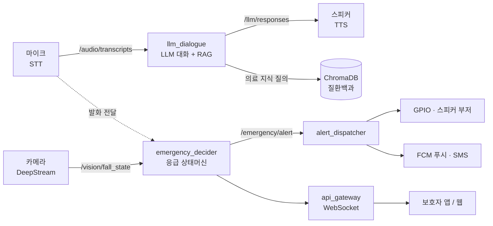
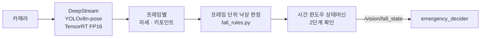
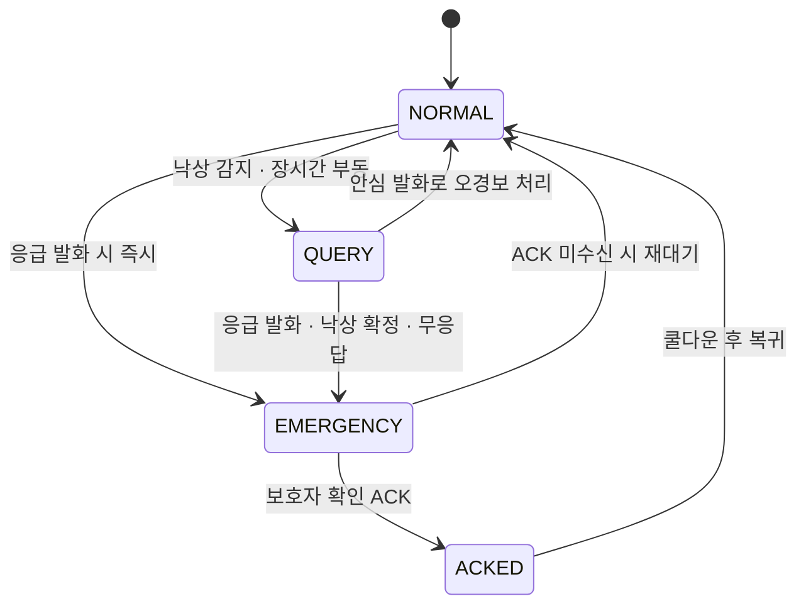

# 🧡 마음돌봄 (Mind Care) 챗봇 프로젝트
### **음성 대화 · 의료 지식 RAG · 낙상 감지 · 응급 알림** — NVIDIA Jetson AGX Xavier 한 대에서 동작하는 온디바이스 돌봄 로봇 소프트웨어


---

## 📌 프로젝트 요약 (Project Overview)

마음돌봄은 **NVIDIA Jetson AGX Xavier 한 대에서 모든 AI 추론이 동작하는 온디바이스 돌봄 로봇/단말 소프트웨어**입니다. 카메라와 마이크로 독거 어르신의 상태를 살피고, 따뜻한 말벗이 되어 한국어로 대화하며, 낙상이나 응급 발화를 감지하면 즉시 보호자에게 알립니다. 음성 인식(STT)부터 대형 언어모델(LLM) 대화, 의료 지식 검색(RAG), 비전 인식, 응급 판단까지 — 클라우드에 의존하지 않고 엣지 디바이스 위에서 전 과정을 처리합니다.

기술적으로는 **ROS 2 토픽 버스 위에 음성 · 비전 · 응급 · API 네 개의 서브시스템을 느슨하게 결합**한 구조입니다. 이 프로젝트가 답하고자 한 핵심 질문은 다음과 같습니다. **7.8B 규모의 한국어 LLM을 32GB Jetson에서 실시간 대화가 가능한 속도로 돌릴 수 있는가 / 건강 질문에 환각 없이 신뢰할 수 있는 의료 근거로 답할 수 있는가 / 낙상을 놓치지 않으면서도 앉기·굽히기 같은 일상 동작을 오검출하지 않을 수 있는가 / 응급 상황을 오경보 없이 보호자에게 확실하게 전달할 수 있는가** — 이 네 가지를 온디바이스 환경에서 코드로 검증하는 것이 목표였습니다.

---

## 🎯 핵심 목표 (Motivation)

| 핵심 기능 &emsp;&emsp;&emsp;&emsp; | 상세 목표 |
| :--- | :--- |
| **음성 대화 (Voice Dialogue)** | 음성 인식(STT) → EXAONE LLM → 음성 합성(TTS) 파이프라인으로 어르신과 자연스러운 한국어 대화를 주고받음 |
| **의료 지식 RAG** | 서울아산병원 질환백과를 벡터 DB로 색인하여, 건강 질문에 환각 없이 신뢰할 수 있는 근거로 응답 |
| **비전 케어 (Vision Care)** | 얼굴·표정 인식으로 정서 상태를 파악하고, YOLOv8-pose 자세 추정 기반으로 낙상을 감지 |
| **응급 대응 (Emergency Response)** | 4단계 상태머신으로 오경보를 거른 뒤, 부저·푸시·SMS 다중 채널로 보호자에게 경보 발령 |
| **보호자 연동 (Caregiver Link)** | 모바일 Flutter 앱 / 웹 대시보드로 어르신의 실시간 상태와 경보를 수신 |

---

## 📂 프로젝트 구조 (Project Structure)

```text
마음돌봄/
├─ mind_care_vision/                  # 음성·대화 서브시스템 + RAG
│  ├─ mind_care_vision/               #   ROS 2 패키지: audio_bridge / llm_dialogue / tts 노드, rag.py
│  ├─ config/                         #   ROS 파라미터 (hri_params*.yaml)
│  ├─ launch/                         #   launch 파일
│  ├─ scripts/                        #   기동·점검 스크립트 (start_llama_server.sh 등)
│  └─ tools/                          #   RAG 인덱스 구축 도구
├─ release/
│  ├─ vision/mind_care_perception/    # 비전 ROS 2 패키지 (얼굴·표정·낙상)
│  └─ emergency/
│     ├─ mind_care_emergency/         #   응급 판단 상태머신 + 알림 디스패처
│     └─ mind_care_api/               #   FastAPI 게이트웨이 + WebSocket + 웹 데모 클라이언트
├─ urgent_alarm_app/                  # 보호자용 Flutter 앱
├─ requirements.*.txt                 # Python 의존성 (core / xavier / full)
├─ SETUP.md                           # 설치 가이드
├─ XAVIER_INSTALL_GUIDE.md            # Jetson AGX Xavier 상세 설치 가이드
└─ HANDOVER.md                        # 코드베이스 인수인계 / 구성 개요
```

> 📱 보호자 Flutter 앱(`urgent_alarm_app/`)을 빌드하려면 본인 Firebase 프로젝트의 `google-services.json`을 `urgent_alarm_app/android/app/`에 직접 배치해야 합니다 (보안상 저장소에 포함되지 않음).

**ROS 2 패키지 (4개)**

| 패키지 | 주요 노드 | 역할 |
| :--- | :--- | :--- |
| `mind_care_vision` | `audio_bridge_node`, `llm_dialogue_node`, `tts_node` | STT · LLM 대화 · RAG · TTS |
| `mind_care_perception` | `vision_deepstream_node`, `fall_detection_node` | 얼굴/표정 인식, 낙상 감지 |
| `mind_care_emergency` | `emergency_decider_node`, `alert_dispatcher_node` | 응급 판단, 다중 채널 알림 |
| `mind_care_api` | `api_gateway_node` | FastAPI + WebSocket 보호자 게이트웨이 |

---

## 🏗️ Architecture & 핵심 구현 (Architecture & Core Implementation)

### 1. 시스템 아키텍처

ROS 2 토픽 버스 위에서 음성 · 비전 · 응급 · API 서브시스템이 느슨하게 결합되어 동작합니다. 토픽으로 분리되어 있어 각 파트를 독립적으로 개발 · 교체 · 테스트할 수 있습니다.



### 2. 언어모델 (LLM)

어르신과 자연스러운 한국어 대화를 주고받는 부분입니다. 한국어에 강한 **EXAONE-3.5-7.8B-Instruct**(LG AI Research)를 기본 모델로 쓰고, `llama.cpp` 서버로 추론합니다.

| 항목 | 내용 |
| :--- | :--- |
| **기본 모델** | EXAONE-3.5-7.8B-Instruct — 한국어 네이티브 (대체 모델: Qwen2.5-3B) |
| **경량화** | GGUF 양자화 — `Q3_K_M`(속도) / `Q4_K_M`(품질), 약 4~4.7 GB |
| **추론 환경** | llama.cpp 서버 · GPU 부분 오프로드 · 컨텍스트 2048 토큰 |

`llm_dialogue_node`는 가장 최근 발화만 처리해 지연이 쌓이지 않게 하고, RAG가 켜져 있으면 관련 의료 지식을 프롬프트에 함께 넣어 요청합니다. 페르소나는 70~80대 어르신을 돌보는 다정한 말벗 으로, 1~2문장으로 짧게 답하며 **의학적 진단이나 약 복용 지시는 하지 않도록** 시스템 프롬프트로 제약했습니다.

### 3. 의료 지식 검색 (RAG)

건강 관련 질문에 **신뢰할 수 있는 의료 정보를 근거로** 답하기 위한 검색 증강 생성(RAG) 모듈입니다. **서울아산병원 질환백과**(17개 진료 분야)를 `BAAI/bge-m3` 임베딩으로 벡터화해 ChromaDB에 색인하고, 질문과 유사한 상위 문서를 찾아 LLM 프롬프트에 근거로 넣습니다.

검색 결과는 "진단 · 처방 금지" 같은 사용 규칙과 함께 시스템 메시지로 주입되어, LLM이 임의로 지어내지 않고 **검색된 근거 안에서만** 답하도록 유도합니다.

```
<참고자료>
[1] (질환백과/신경계) 치매 — 정의 …
[2] (질환백과/심혈관) 고혈압 — 생활관리 …
</참고자료>
```

> ⚠️ 의료 코퍼스(`med_data/`)와 벡터 인덱스는 저작권 문제로 저장소에 포함되지 않습니다. 출처의 이용약관에 따라 직접 수집 · 구축해야 하며, 임베딩 모델을 바꾸면 ChromaDB를 다시 빌드해야 합니다.

### 4. 낙상 감지 (Fall Detection)

카메라 영상에서 자세를 추정하고, **매 프레임의 낙상 여부를 시간 윈도우로 누적**해 순간 오검출을 거른 뒤 실제 낙상을 확정합니다. 구현: `release/vision/mind_care_perception/`



`YOLOv8n-pose`로 사람의 자세와 키포인트를 검출하고(Jetson에서 TensorRT FP16으로 가속), `fall_rules.py`가 매 프레임을 낙상/정상으로 판정합니다. 한 프레임만 보는 신호(바운딩박스 종횡비, 머리 높이 급강하)는 앉기·굽히기와 구분하기 어렵기 때문에, 상태머신이 두 단계로 확인합니다.

- **`fall_detected`** — 짧은 시간 윈도우 안에서 낙상으로 판정된 프레임 비율이 일정 수준 이상
- **`fall_confirmed`** — 그 뒤로 몇 초간 거의 움직임이 없음(쓰러진 채 정지) → 실제 낙상으로 확정

확정 결과는 `/vision/fall_state`로 발행되어 `emergency_decider`가 응급 상태로 전이시킵니다.

### 5. 응급 판단 (Emergency Decision)

낙상이나 응급 발화 같은 위험 신호를 받아 **4단계 상태머신**으로 응급 여부를 판정하고, 오경보를 거른 뒤 경보를 발령합니다. 구현: `release/emergency/mind_care_emergency/`



- **NORMAL** — 평상시. 낙상 감지·장시간 부동이면 `QUERY`로, 응급 발화면 즉시 `EMERGENCY`로 전이
- **QUERY** — "괜찮으세요?"라고 먼저 묻고 잠시 대기. 안심 발화면 `NORMAL`로 복귀(오경보로 기록), 무응답·응급 발화·낙상 확정이면 `EMERGENCY`
- **EMERGENCY** — 경보 발령. 보호자가 확인(ACK)하면 `ACKED`, 일정 시간 응답이 없으면 `NORMAL`로 자동 복귀해 다음 응급에 대비
- **ACKED** — 보호자 확인 완료. 쿨다운 후 `NORMAL`

응급 발화는 질환명이 아니라 **본인이 위급함을 호소하는 표현**("도와줘 · 살려줘 · 숨을 못 쉬" 등)으로 감지합니다. `EMERGENCY`에 진입하면 경보가 `alert_dispatcher`를 통해 **GPIO · 스피커 부저 · FCM 푸시 · SMS**로, `api_gateway`를 통해 **보호자 웹**으로 동시에 전파됩니다.

### 6. 하드웨어 구성

| 구성 요소 | 사양 / 모델 | 용도 |
| :--- | :--- | :--- |
| **메인 컴퓨트** | NVIDIA Jetson AGX Xavier 32 GB (JetPack 5.x, Ubuntu 20.04, CUDA 11.4) | 온디바이스 AI 추론 전체 |
| **카메라** | USB UVC 또는 CSI 카메라 (720p / 30 fps 이상) | 얼굴·표정·낙상 인식 |
| **마이크** | USB 마이크 (ReSpeaker 4-Mic Array 권장) | 음성 입력 / VAD |
| **스피커** | 3.5 mm 또는 USB 스피커 | TTS 음성 출력 |
| **부저** | 5 V 액티브 부저 (GPIO BOARD pin 7) | 응급 알림음(사이렌) |
| **네트워크** | 이더넷 권장 | 모델 다운로드, edge-TTS |
| **보호자 단말** | 스마트폰(Flutter 앱) 또는 웹 브라우저 | 실시간 상태·경보 수신 |

---

## 🚀 빠른 시작 (Quick Start)

전체 설치 절차는 [`SETUP.md`](SETUP.md), Jetson 상세 가이드는 [`XAVIER_INSTALL_GUIDE.md`](XAVIER_INSTALL_GUIDE.md)를 참고하세요.

```bash
# 1) 의존성 설치 (가상환경)
python3 -m venv .venv-ros --system-site-packages
source .venv-ros/bin/activate
pip install -r requirements.xavier.txt        # Jetson 환경

# 2) ROS 2 워크스페이스 빌드
cd ~/ros2_ws && colcon build --symlink-install
source install/setup.bash

# 3) LLM 서버 기동
bash mind_care_vision/scripts/start_llama_server.sh

# 4) HRI 시스템 기동
ros2 launch mind_care_vision hri_system.launch.py
```

---

## ✨ 주요 결과 및 분석 (Key Findings & Analysis)

개발하면서 직접 부딪혀 보고 내린 결정들입니다.

| 발견 / 결정 | 내용 |
| :--- | :--- |
| **낙상은 한 프레임으로 판단할 수 없다** | 초기 버전은 앉기·물건 줍기를 낙상으로 자주 오인했습니다. 한 장면이 아니라 시간 윈도우로 모아 보고, 쓰러진 뒤 정지 상태까지 확인하는 2단계 검증을 넣어 URFDD 데이터셋 기준 **Recall 0.77 / Precision 0.68**을 확보했습니다. |
| **응급 키워드는 "증상 호소" 위주로** | 질환명을 그대로 매칭하니 RAG 의료 상담 중 단순 정보 질문까지 응급으로 잡혔습니다. 본인이 위급함을 호소하는 표현 위주로 키워드를 다시 추렸습니다. |
| **경보보다 질문을 먼저** | 헛경보가 반복되면 보호자가 알림을 무시하게 됩니다. 위험 신호가 잡히면 곧바로 경보를 울리는 대신 `QUERY` 단계에서 "괜찮으세요?"를 먼저 물어 오경보를 걸러냈습니다. |
| **온디바이스 LLM은 속도와 품질의 타협** | 7.8B 모델을 작은 보드에서 실시간으로 돌리려면 품질을 조금 양보해야 했습니다. 양자화 · GPU 부분 오프로드 · 짧은 응답 길이를 조합해 "그나마 대화가 되는" 지점을 찾았습니다. |
| **경보는 다중 채널 + 자동 복귀로** | 알림 채널이 하나면 보호자가 놓칠 수 있습니다. 부저·푸시·SMS·웹 네 채널로 동시에 알리고, 보호자 응답이 없으면 시스템이 스스로 평상 상태로 돌아가 다음 응급에 대비합니다. |

---

## 💡 회고록 (Retrospective)

처음 이 프로젝트를 시작할 때만 해도 우리가 가진 건 "독거 어르신을 위한 돌봄 로봇을 만들자"는 막연한 목표 하나뿐이었습니다. AI를 배운 지 얼마 안 된 입장에서 음성 인식, 언어모델, 비전, 응급 알림을 한꺼번에 다뤄야 한다는 게 솔직히 막막했습니다. 그런데 정작 가장 먼저 부딪힌 벽은 모델이 아니라 장비였습니다. Jetson Xavier라는 작은 보드에 운영체제를 처음 깔고 ROS 2와 CUDA 환경을 맞추는 데만 며칠이 걸렸고, 버전이 조금만 어긋나도 설치가 통째로 깨졌습니다. 코드를 짜기도 전에 환경 설정에서 이렇게 고생할 줄은 몰랐다는 말을, 팀원들끼리 며칠 동안 몇 번이나 했는지 모릅니다.

다음 고비는 언어모델을 실제로 그 보드 위에서 돌리는 일이었습니다. 노트북에서는 잘 돌아가던 모델이 Jetson에 올리자마자 메모리가 부족하다는 에러를 쏟아냈습니다. 7.8B짜리 모델은 그대로는 도저히 올라가지 않아서, 모델을 더 가볍게 압축하는 '양자화'라는 작업을 처음 공부해 가며 적용했습니다. 용량을 줄이니 메모리에는 올라갔지만 이번엔 응답이 너무 느려서, 어르신이 말을 걸고 한참을 기다려야 답이 돌아왔습니다. 답변 길이를 짧게 제한하고 모델을 어디까지 GPU에 올릴지 설정을 수십 번 바꿔 가며, '그나마 대화가 되는' 지점을 겨우 찾아냈습니다. 어디에도 정답이 적혀 있지 않고 직접 숫자를 바꿔 보며 균형점을 찾아야 한다는 걸, 이때 처음 몸으로 배웠습니다.

테스트를 하면서 가장 골치 아팠던 건 낙상 감지였습니다. 처음 만든 버전은 어르신이 의자에 앉기만 해도, 허리를 굽혀 물건을 줍기만 해도 '낙상!'이라며 경보를 울렸습니다. 그렇다고 둔감하게 만들면 이번엔 진짜 쓰러졌을 때를 놓쳤습니다. 한 장면만 보고 판단하지 말고 잠깐 동안의 움직임을 모아서 보도록, 그리고 쓰러진 뒤에 한동안 움직임이 없는지까지 확인하도록 단계를 나누면서 조금씩 나아졌습니다. 응급 판단도 비슷했습니다. 위험 신호가 잡히면 곧바로 보호자에게 알리는 대신, 로봇이 먼저 "괜찮으세요?" 하고 말을 거는 단계를 한 칸 넣었습니다. 헛경보가 반복되면 보호자가 알림 자체를 무시하게 된다는 걸, 테스트를 거듭하면서 알게 됐기 때문입니다.

프로젝트를 마치고 돌아보면, 우리가 한 일은 대단한 모델을 새로 만든 게 아니었습니다. 오히려 이미 나와 있는 기술들을 작은 보드 하나에 어떻게든 함께 올리고, 안 되는 부분을 하나씩 깎아 내는 과정의 연속이었습니다. 에러 메시지를 검색해 보고, 막히면 다른 방법을 시도하고, 각자 맡은 부분을 합치다 충돌이 나면 다시 맞추는 일을 반복했습니다. 그런 사소하고 더딘 작업들이 결국 프로젝트를 굴러가게 했습니다. 모델의 성능 숫자만 들여다보던 시야가 '이걸 실제로 어디에서, 어떤 환경에서 돌릴 것인가'까지 넓어진 것이, AI를 공부하는 우리에게는 이번 프로젝트의 가장 큰 수확이었습니다.

---

## 🔗 참고 자료 (References)

**기술 스택 & 데이터**
- [EXAONE-3.5-7.8B-Instruct](https://huggingface.co/LGAI-EXAONE/EXAONE-3.5-7.8B-Instruct) — LG AI Research 한국어 LLM
- [llama.cpp](https://github.com/ggml-org/llama.cpp) — GGUF 양자화 모델 추론 엔진
- [BAAI/bge-m3](https://huggingface.co/BAAI/bge-m3) — 다국어 임베딩 모델 (RAG)
- [ChromaDB](https://www.trychroma.com/) — 벡터 데이터베이스
- [Ultralytics YOLOv8](https://github.com/ultralytics/ultralytics) — 자세 추정(pose) 모델
- 서울아산병원 질환백과 — 의료 지식 코퍼스 출처
- URFDD (University of Rzeszow Fall Detection Dataset) — 낙상 감지 평가셋

**프로젝트 문서**
- [`SETUP.md`](SETUP.md) — 설치 및 환경 구성
- [`XAVIER_INSTALL_GUIDE.md`](XAVIER_INSTALL_GUIDE.md) — Jetson AGX Xavier 상세 설치 (플래시 ~ 자동시작)
- [`HANDOVER.md`](HANDOVER.md) — 코드베이스 인수인계 / 구성 개요
- [`결과보고서_초안.md`](결과보고서_초안.md) — 프로젝트 개요 · 아키텍처 · 평가 결과

---

## 📄 라이선스 (License)

본 저장소의 **소스 코드**는 [MIT License](LICENSE)를 따릅니다. 단, 다음은 별도 약관이 적용되며 본 저장소에 포함되지 않습니다.

- **의료 지식 데이터** (`med_data/`) — 서울아산병원 질환백과 등 원출처의 저작권·이용약관을 따릅니다.
- **언어모델 가중치** — EXAONE, Qwen 등 각 모델의 라이선스를 따릅니다.

---

<sub>NVIDIA AI Academy · 포테토 팀</sub>
